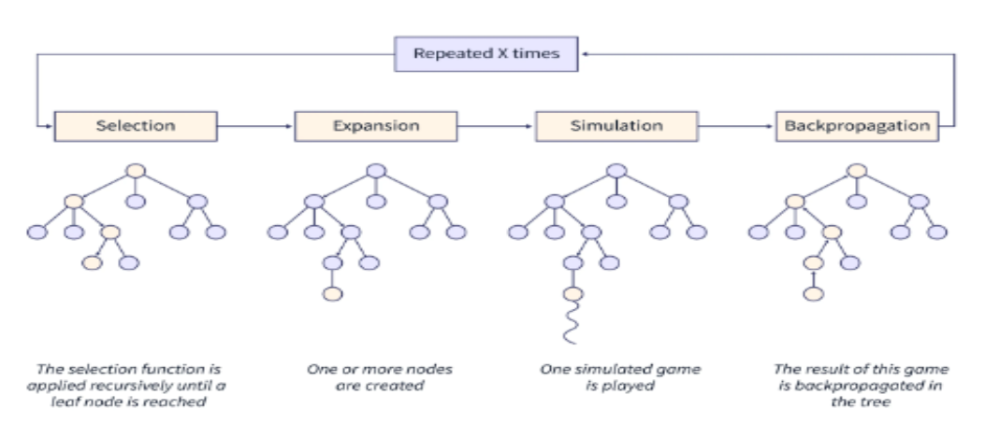
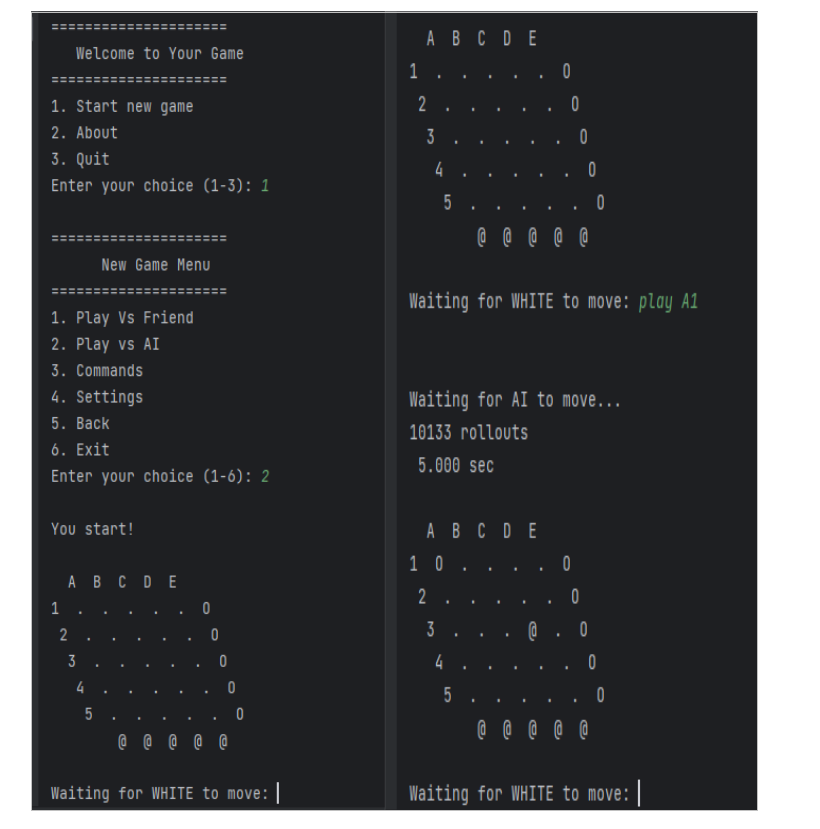
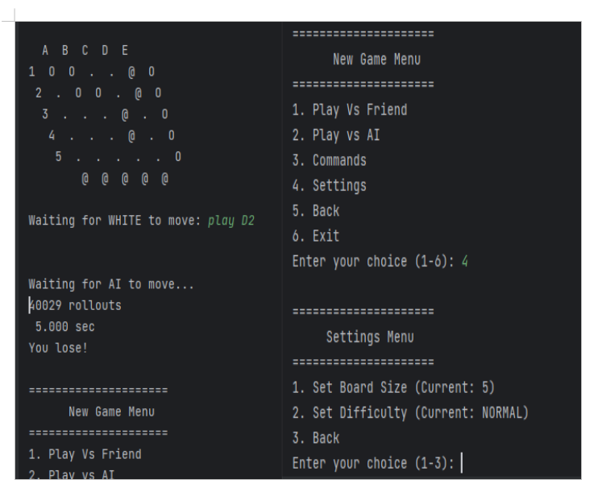

# Hex Game AI Project
## Description
This project implements the Monte Carlo Tree Search (MCTS) algorithm for the Hex game between a player and an AI agent. Hex is a strategy game where players aim to form a continuous path from one side of the board to the other using hexagons.

## Monte Carlo Tree Search (MCTS)
The MCTS algorithm plays a crucial role in this project, driving the AI agent's decision-making process. It intelligently explores the game tree, balancing between exploration and exploitation to find optimal moves. The algorithm's efficiency and adaptability make it well-suited for complex game environments like Hex.

## Features
    Implements MCTS algorithm for decision-making.
    Utilizes the Go Text Protocol (GTP) for user-agent interaction.
    Includes game logic management and user interface components.

## Project Settings and User Possibilities
    Game Settings: Users can adjust settings such as board size and AI difficulty.
    User Interaction: Utilizes the Go Text Protocol (GTP) for seamless communication between the user and the AI agent.
    Game Flow: Players can make moves, view game state, and receive feedback through a user-friendly interface.

## Key Components
    gamestate.py: Manages game logic and state.
    agent.py: Implements the MCTS algorithm for AI decision-making.
    gtp.py: Implements communication using the Go Text Protocol.
    game_manager.py, console_ui.py: Facilitates user interaction and interface.

 
